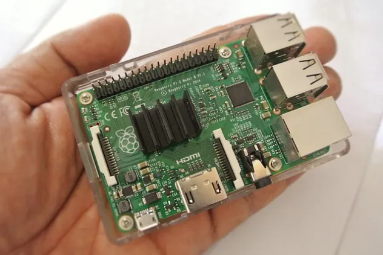

# PyPICache
## A Raspberry Pi-powered PyPI cache

# Table of Contents

- [Introduction](#introduction)
- [Tutorial](tutorial.md#tutorial)
- [How TOs](howto.md#how-to-guides)

## Introduction

PyPICache is a relatively easy-to-make server that serves content from the Python Packaging Index and makes it available offline using a Raspberry Pi. It allows you to create a selective clone of the Python Packaging Index to and make it available to computers over a WIFI connection.

To set up PyPICache initially, you need an Internet connection and a Raspberry Pi(or similar computer) with a wireless chip.