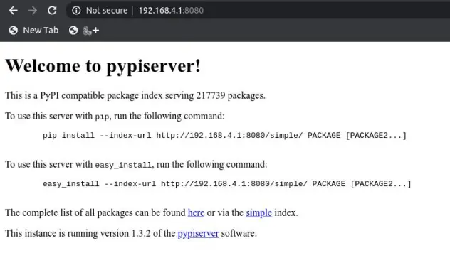

# Tutorial

To setup a Raspberry Pi offline PYPI server, you need the following software packages:

  - dnsmasq -- DNS and DHCP Server software
  - hostapd -- Software to create an access point
  - minirepo -- Use this to clone PyPI for offline use
  - pypiserver -- Creates an index of the cloned PyPI packages
  - nginx -- A web server to serve up the packages to clients

```shell
sudo apt install dnsmasq hostapd nginx
pip install minirepo pypiserver
```

## Setup the network
The goal of this step is to configure a stand-alone network. The Raspberry Pi needs to have a static IP Address assigned to the Wireless port. To configure the static IP, edit the `dhcpcd`` configuration file by running

```bash
sudo nano /etc/dhcpcd.conf
```
and adding the following:

```yaml
interface wlan0
    static ip_address=192.168.4.1/24
    nohook wpa_supplicant
```
### Configure DHCP
Back up the default dnsmasq config file and create a new one:
```bash
sudo mv /etc/dnsmasq.conf /etc/dnsmasq.conf.orig
sudo nano /etc/dnsmasq.conf
```

Add the following to the configuration:

```ini
interface=wlan0
listen-address=192.168.4.1
dhcp-range=192.168.4.2,192.168.4.30,255.255.255.0,24h
address=/raspberrypi.local/192.168.4.1
```

This sets up DHCP for clients connecting through the wireless interface `wlan0`.
The second line tells the DHCP server(dnsmasq) to listen to connections coming in from the static IP address you setup in the previous step.
The third line configures DHCP to provide IP addresses in the range 192.168.4.2 to 192.168.4.30 with a lease time of 24 hours.

### Configure an Access Point

To allow client devices to connect to your Raspberry PI server, configure a wireless access point using `hostapd`

```properties
interface=wlan0
driver=nl80211
ssid=NameOfNetwork
hw_mode=g
channel=7
wmm_enabled=0
macaddr_acl=0
auth_algs=1
ignore_broadcast_ssid=0
wpa=2
wpa_key_mgmt=WPA-PSK
wpa_pairwise=TKIP
rsn_pairwise=CCMP
wpa_passphrase=YourNetworkPassword
```

Add your own network name and network password in the ssid and wpa_passphrase sections.
Configure `hostapd` to use the config file:

```bash
sudo nano /etc/default/hostapd
```
Find the line with `#DAEMON_CONF`, uncomment it be removing the # at the beginning of the line and add a path to the conf file you created in the previous step. 
After that, the line should look like this:

```bash
DAEMON_CONF="/etc/hostapd/hostapd.conf"
```

### Add routing and masquerade
Edit `/etc/sysctl.conf` and uncomment the line that says:
`net.ipv4.ip_forward=1`

Add a masquerade for outbound traffic on eth0:
```bash
sudo iptables -t nat -A POSTROUTING -o eth0 -j MASQUERADE
```

Save the new rule:
```bash
sudo sh -c "iptables-save > /etc/iptables.ipv4.nat"
```

Edit `/etc/rc.local` and add the following above “exit 0” to install the rules at boot:

`iptables-restore < /etc/iptables.ipv4.nat`

This is important if you decide to share an internet connection or set up a bridge on the Raspberry Pi later.

The Raspberry Pi should be ready to work as an access point. If you're connected to it directly, now would be a good time to enable SSH. Reboot the Raspberry Pi and test if everything works.

Using a different WiFi-enabled device like a phone or laptop, scan for new wireless networks. If everything went smoothly, you should see the WiFi network you created above. Try connecting to it.


## Clone PyPI

In this section, you will set up the tools to clone and serve Python packages from the Python Package Index, namely `minirepo`, `pypiserver` and `nginx`.

### minirepo

Minirepo is a command line program that downloads packages from PyPI.org so you can use pip without Internet access. The easiest way to install it is to use pip:

```bash
$ pip install minirepo
```

The first time it’s executed, `minirepo` will prompt you for the local repository path(where it should save downloaded packages), which defaults to `~/minirepo` in Linux. It also creates a JSON configuration file in `~/.minirepo`, which you can edit to your preferences.

There are several alternatives out there for cloning PyPI, `minirepo` is a good option because it allows you to download a selective mirror, only downloading all sources for Python 3, for example. At the time of writing this post, the entire PyPI repository is somewhere in the neighbourhood of 1TB but, by using a selective download, I was able to get it down to 120GB or so. 

> **Note:**
> The `minirepo` package on PyPI has not been updated for a few years. 
> If you run into trouble running it, consider cloning PyPI using a tool such as `bandersnatch` or installing `minirepo` from source to get the latest version.


Here's a sample configuration you can use:

```
{
  "processes": 10,
  "package_types": [
    "bdist_egg",
    "bdist_wheel",
    "sdist"
  ],
  "extensions": [
    "bz2",
    "egg",
    "gz",
    "tgz",
    "whl",
    "zip"
  ],
  "python_versions": [
    "3.5.7",
    "3.6.9",
    "3.7.2",
    "3.7.3",
    "3.7.4",
    "any",
    "cp27",
    "py2",
    "py2.py3",
    "py27",
    "source"
  ],
  "repository": "/home/minirepo"
}
```

This configuration downloads sources for Python 3 and limits the package types to `sdist`, `bdist_wheel`, and `bdist_egg` packages. The downside of using this approach is that some packages that don't meet the filter criteria will not get downloaded.

Cloning PyPI can take a long time, depending on your connection speed, so you'll want to leave it running in the background until it completes.

### Pypiserver

At this point, you should have PyPI mirrored to your Raspberry PI. The next step is to serve up the local package index to enable pip clients to download the packages over the network using `pypiserver`.

Start the `pypiserver` on any unused port and point it to the folder containing the downloaded packages. In the example below we run `pypiserver` on port 8080:

```bash
pypi-server -p 8080 ~/minirepo
```

Notice that when running `pypiserver`, the command to run it is `pypi-server` and not `pypiserver`. The `pypi-server`process will keep running in the background until you either kill it or shutdown the Raspberry Pi. We'll cover how to start it at boot shorlty.

To test that `pypiserver` works correctly, visit the static IP you set for the Rasberry Pi at port 8080 in your browser. You should see a message similar to the one below:



If everything is set up correctly, you should now be able to install Python packages from the local mirror. To do this, pass in a `index-url` flag to pip that points to the server's IP address:

```bash
pip install --index-url http://192.168.4.1:8080/ package_name
```

where `package_name` is the package you want to install.

When you run the command above, you're likely to get an “untrusted” warning from `pip`, urging you to append the `--trusted-host` option:

```pip --trusted-host 192.168.4.1 install --index-url http://192.168.4.1:8080/ package_name```

An even shorter way:
`pip --trusted-host 192.168.4.1 install -i http://192.168.4.1:8080/ package_name`

This is a temporary workaround; a permanent solution is to set up an SSL certificate on the server.

Specifying the local PyPI URL and setting the trusted host flags every time you run a `pip install` can be cumbersome. If you prefer to consistently install packages from your local mirror, it's a good idea to create a global pip configuration file in your home directory or within a virtual environment and add these options.

To configure the trusted host and index url globally on Unix-like OSes, create the pip configuration file in the home directory file in: `$HOME/.pip/pip.conf`. On Windows create the file in: `%HOME%\pip\pip.ini`.

To do the same in a virtual environment instead, create the configuration file in `$VIRTUAL_ENV/pip.conf` for Linux and MacOS and `%VIRTUAL_ENV%\pip.ini` on Windows where `VIRTUAL_ENV` is the name of your virtual environment.

Add the following to the configuration file:

```
[global]
trusted-host = 192.168.4.1

[install]
index-url = http://192.168.4.1:8080
```


## Set up a web server

By default, `pypiserver` scans the entire packages directory each time an incoming HTTP request occurs. This can cause significant slowdowns when serving a large number of packages like we are in this instance. One way around this is to put `pypiserver` behind a reverse proxy with caching enabled. We will use `nginx` in this tutorial.

### Create a virtual host in nginx

In this tutorial, we'll refer to the new virtual host as `cheeseshop.com`, but you can use any domain you like. [CheeseShop](https://wiki.python.org/moin/CheeseShop) is the secret code name for the Python Package Index. Create a file `/etc/nginx/sites-available/cheeseshop.com` and add the following: 


```
# /etc/nginx/sites-available/cheeseshop.com

proxy_cache_path /data/nginx/cache
                 levels=1:2
                 keys_zone=pypiserver_cache:10m
                 max_size=10g
                 inactive=24h
                 use_temp_path=off;
 
 
upstream pypi {
        server 127.0.0.1:8080;
}
 
server {
        listen 80;
        server_name cheeseshop.com;
        autoindex on;
        location / {
          proxy_set_header Host $host:$server_port;
          proxy_set_header X-Forwarded-Proto $scheme;
          proxy_set_header X-Real-IP $remote_addr;
          proxy_cache pypiserver_cache;
          proxy_pass       http://pypi;
        }
}
```

This configuration configures `nginx` to cache all requests to the pypiserver. Whenever a request is proxied to the upstream `pypiserver`, Nginx checks if the response is already cached. If the response is in the cache and still valid, Nginx serves it directly without forwarding the request to the pypiserver. This improves performance and reduces the load on the pypiserver.

To enable this new virtual host, you'll want to create a symbolic link to the config file you just created in the `/etc/nginx/site-enabled` folder:
```bash
sudo ln -s /etc/nginx/sites-available/cheeseshop.com /etc/nginx-sites-enabled/
```

Doing this will enable the new virtual host. Check that everything works by running
`sudo nginx -t`. If everything checks out, great! Next, you want to make a small DNS change to map the `cheeseshop.com` domain to an IP address.

Open `/etc/hosts` and add an entry for the newly created cheeseshop.com domain:

```
192.168.4.1     cheeseshop.com
```

The `hosts` file contains domain to IP address mappings that help the computer serve you the right content. Dnsmasq will check this file whenever it starts up so it is a good idea to restart it:

`sudo service dnsmasq restart`

Restart nginx too for good measure:

`sudo service nginx restart`

Assuming everything went smoothly, you should be able to install Python packages from client computers using a hostname as opposed to using an IP now.


## Using PyPICache

To test this out, connect to the Raspberry Pi's WiFi network and create a new virtual environment on a client computer and run the following command inside the virtual environment:

`pip --trusted-host cheeseshop.com install -i http://cheeseshop.com django`

Running that command produces the following output:
```shell
pip --trusted-host cheeseshop.com install -i http://cheeseshop.com django
Looking in indexes: http://cheeseshop.com
Collecting django
  Downloading http://cheeseshop.com:80/packages/Django-3.0.1.tar.gz (9.0 MB)
     |████████████████████████████████| 9.0 MB 1.1 MB/s
Collecting pytz
  Downloading http://cheeseshop.com:80/packages/pytz-2019.3-py2.py3-none-any.whl (509 kB)
     |████████████████████████████████| 509 kB 1.3 MB/s
Collecting sqlparse>=0.2.2
  Downloading http://cheeseshop.com:80/packages/sqlparse-0.3.0-py2.py3-none-any.whl (39 kB)
Collecting asgiref~=3.2
  Downloading http://cheeseshop.com:80/packages/asgiref-3.2.3-py2.py3-none-any.whl (18 kB)
Building wheels for collected packages: django
  Building wheel for django (setup.py) ... done
  Created wheel for django: filename=Django-3.0.1-py3-none-any.whl size=7428296 sha256=b31336b1249afbdbb2374912f6983179f4715127d7e6b842a8455a94a1518ce5
  Stored in directory: /home/terra/.cache/pip/wheels/6f/55/5c/aca7917f1899fbb7430677d9d6ef7c6be748c412dec3e63c04
Successfully built django
Installing collected packages: pytz, sqlparse, asgiref, django
Successfully installed asgiref-3.2.3 django-3.0.1 pytz-2019.3 sqlparse-0.3.0

```